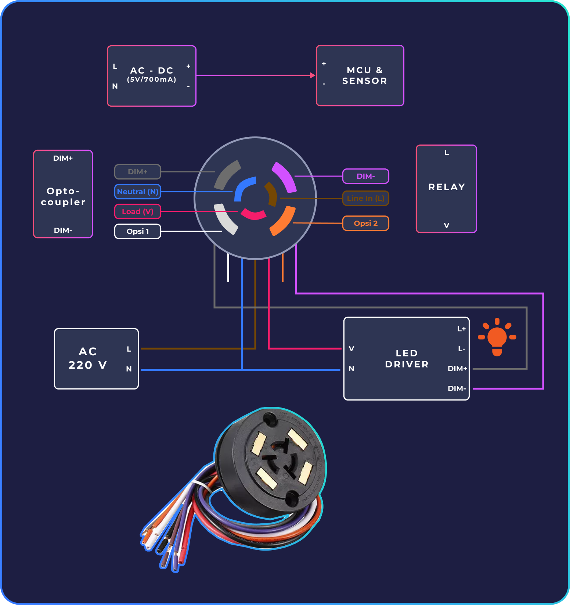
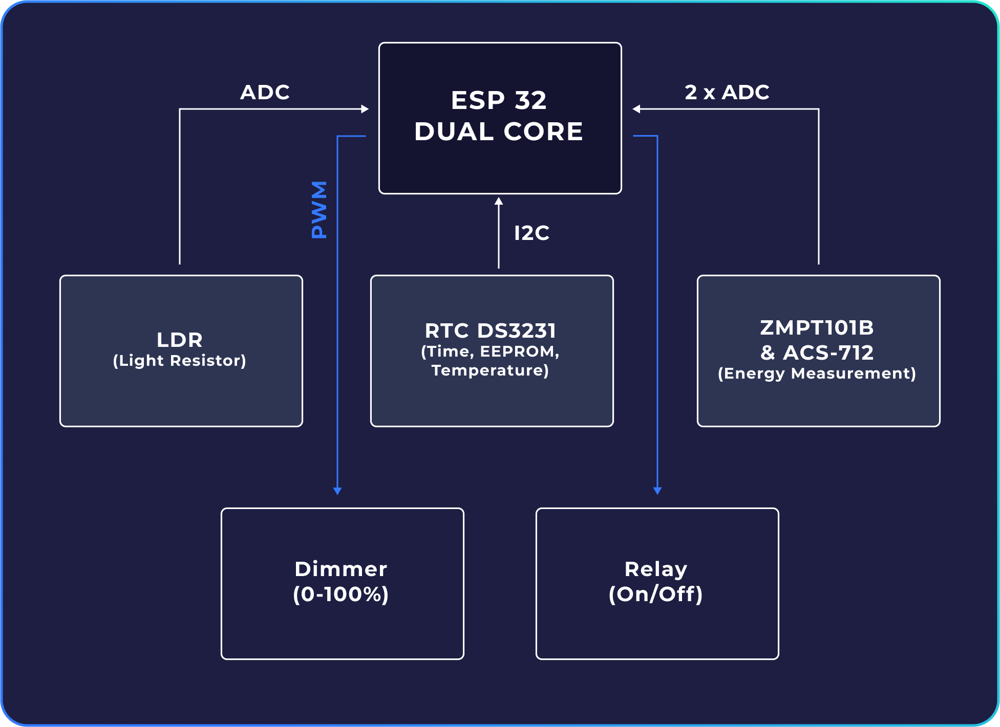

# **SMART PJU X-CAMP**

_Created by [Faris Rafi](https://www.linkedin.com/in/farisrafp/), last updated on 20 May 2023_

## **About SMART PJU**

This Smart PJU is a continuation of X-Bright with the addition of new features such as communication using LoRa, the use of new sensors, and the use of new modules. This Smart PJU also uses the concept of IoT (Internet of Things) which allows users to control this street lamp through the dashboard provided.

### **Wiring Diagram**

### **Hardware**

|               Controller V2               |
| :---------------------------------------: |
|  |

|            Power V2             |
| :-----------------------------: |
|  |

Documentation can be seen [here](./hardware/)

### **Firmware**

Here is the sensor diagram and pinout used on Controller V2.

Documentation can be seen [here](./firmware/)

## **Contact**

If you have any questions, please contact Faris, the product's designer, by E-mail.

Email : farisrafp@gmail.com
