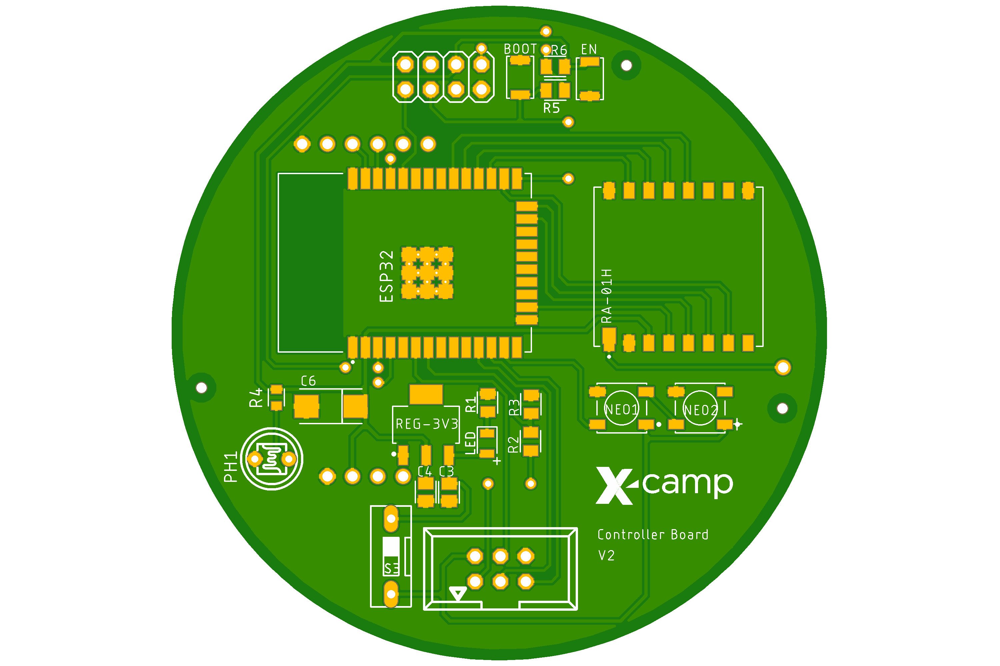
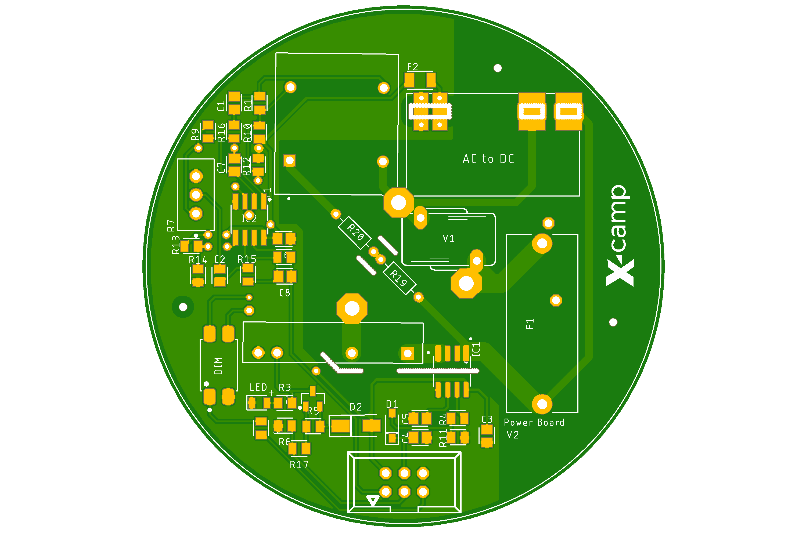

# **SMART PJU X-CAMP**

Created by [Faris Rafi](www.linkedin.com/in/farisrfp/), last updated on 26 April 2023

## **About SMART PJU**

Smart PJU ini merupakan project lanjutan dari X-Bright dengan penambahan fitur baru seperti komunikasi menggunakan LoRa, penggunaan sensor baru, dan penggunaan modul baru. Smart PJU ini juga menggunakan konsep IoT (Internet of Things) yang memungkinkan pengguna dapat mengontrol lampu jalan umum ini melalui internet.

### **Hardware**

|               Controller V2               |
| :---------------------------------------: |
|  |

|            Power V2             |
| :-----------------------------: |
|  |

Dokuementasi lengkap dapat dilihat di [sini](./hardware/README.md)

### **Firmware**

Firmware ini dibuat menggunakan PlatformIO dan Arduino Framework.

Key Features:

- LoRaWAN with LoRa Module
- Dimming Control
- 7 Pin NEMA Socket
- ESP32 Dual Core
- Voltage Monitoring with ZMPT101B
- Current Monitoring with ACS712
- Real Time Clock and Temp with DS3231
- On/Off Switch with SSR

Dokuementasi lengkap dapat dilihat di [sini](firmware/README.md)

## **Contact**

If you have any questions, please contact Faris, the product's designer, by E-mail.

Email : farisrafp@gmail.com
